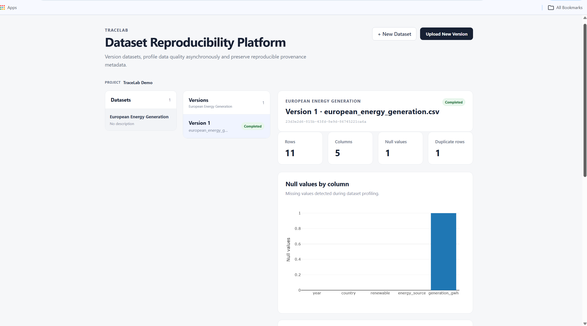

# TraceLab

**Dataset Reproducibility & Data Quality Platform**

TraceLab is a full-stack platform for **immutable dataset versioning, asynchronous data-quality profiling, and provenance tracking**.

Built to demonstrate production-style software engineering for research and data-intensive applications.

**Stack:** Python · FastAPI · PostgreSQL · Redis/RQ · Pandas · React · TypeScript · Plotly · Docker · Alembic · pytest · GitHub Actions

## Demo



The example above profiles a European energy-generation dataset and links the resulting quality report to the exact dataset version and processing run that produced it.

## Features

- **Dataset versioning** — every upload creates an immutable version.
- **Content identity** — SHA-256 checksums identify files and prevent duplicate uploads.
- **Async processing** — Redis/RQ workers profile datasets outside the HTTP request lifecycle.
- **Data-quality profiling** — schema inference, null values, duplicates, row/column counts and numeric summaries.
- **Provenance** — tracks source file, checksum, dataset version, processing job, pipeline version and timestamps.
- **Interactive dashboard** — React, TypeScript and Plotly visualization.
- **Reproducible infrastructure** — Docker Compose and version-controlled Alembic migrations.

## Architecture

```text
React + TypeScript + Plotly
            │
            │ REST
            ▼
         FastAPI
   Router → Service → Repository
       │             │
       │             ▼
       │         Redis / RQ
       │             │
       │             ▼
       │         RQ Worker
       │             │
       ▼             ▼
        PostgreSQL
            │
     Dataset metadata

API + Worker
     │
     ▼
Shared dataset storage
```

The core data model is:

```text
Project
└── Dataset
    └── DatasetVersion
        ├── ProcessingJob
        └── QualityReport
```

PostgreSQL is the system of record, while Redis is used only for background-work coordination.

## Key engineering decisions

**Immutable versions:** uploaded datasets are never overwritten, preserving historical results and provenance.

**SHA-256 identity:** file contents, rather than filenames, determine duplicate uploads.

**Background processing:** potentially expensive profiling is separated from the API request lifecycle using Redis and RQ.

**Layered backend:** FastAPI follows a Router → Service → Repository structure to separate HTTP, application and persistence concerns.

**Database migrations:** Alembic provides append-only, version-controlled schema evolution.

## Run locally

The complete application can be started with Docker:

```bash
docker compose up --build
```

Then open:

- Frontend: `http://localhost:8080`
- API documentation: `http://localhost:8000/docs`

## Quality checks

Backend:

```bash
cd backend
ruff check app tests
pytest -v
```

Frontend:

```bash
cd frontend
npm run lint
npm run build
```

GitHub Actions runs these checks automatically on pushes and pull requests.

## Scope

TraceLab currently supports CSV datasets and shared local/container storage. Future extensions could include object storage, additional file formats, richer validation and authentication.

The project focuses on practical **reproducibility and provenance principles relevant to research and open-science workflows** rather than claiming full FAIR compliance.

## License

MIT